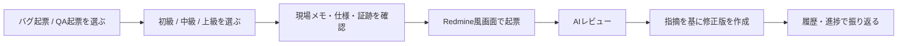
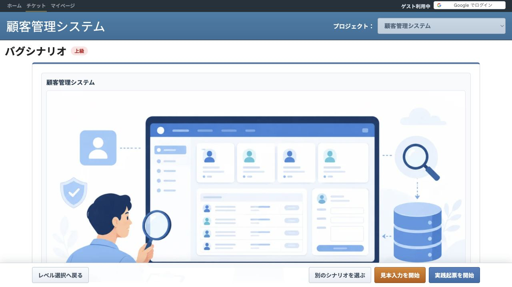
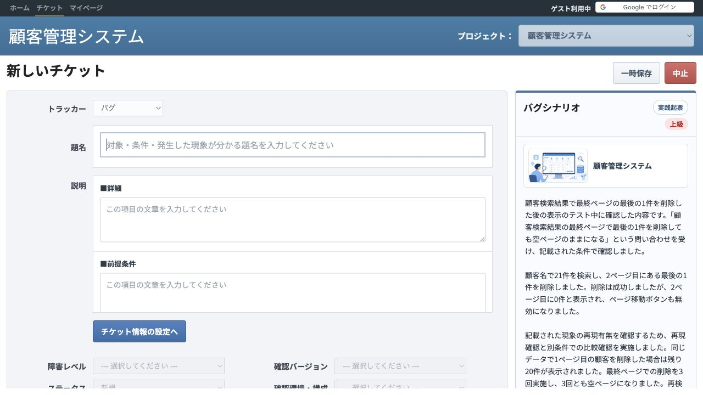
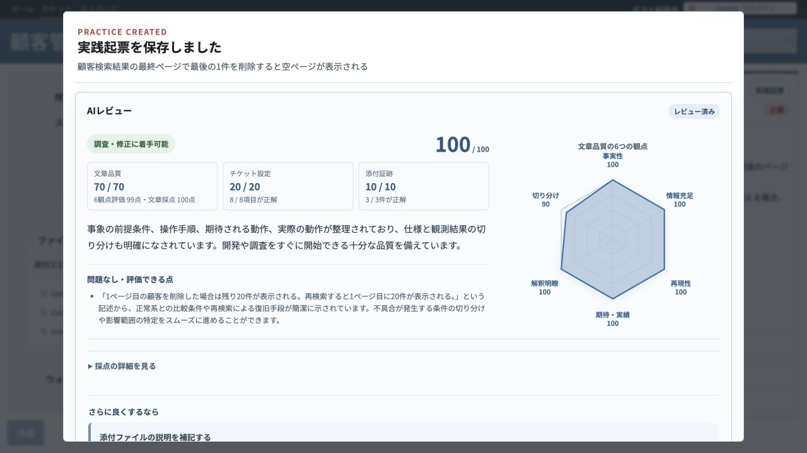
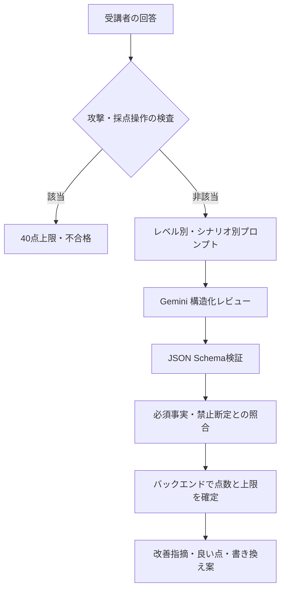
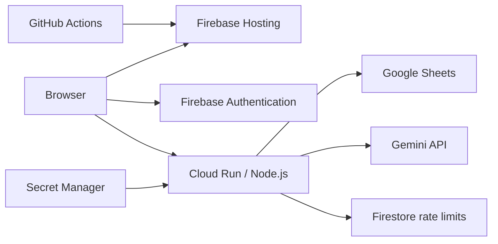

<p align="center">
  
</p>

# あかマイン

現役のテストエンジニアが、QA確認と不具合報告を実務に近いチケット作成とAIレビューで反復練習するWebサービスです。

[公開サービス](https://akamain.com/) ・ [QA確認の書き方](https://akamain.com/qa-question-writing) ・ [不具合報告の書き方](https://akamain.com/bug-report-writing)

> **Status: Public beta**
>
> 学習支援として公開中です。AI評価は改善フィードバック用であり、採用・人事評価・資格認定の単独根拠には使用できません。

## 解決したい課題

QAでは、不具合を見つけるだけでなく、開発者や仕様担当者が次の行動を取れる形で伝える必要があります。しかし、テンプレートを読むだけでは、未整理の事実から題名、再現手順、期待結果、確認事項を組み立てる力は身につきません。

あかマインでは、完成文をAIに作らせません。テストエンジニア自身が断片的な調査情報からチケットを作成し、AIは「その内容で調査・回答を開始できるか」を読み手の立場からレビューします。主対象は現役のテストエンジニアです。経験の浅い担当者の基礎練習にも利用できますが、転職対策を主目的としたサービスではありません。

## 学習フロー



- 10の業務領域
- バグ起票60シナリオ、QA起票60シナリオ
- 見本を入力して型を学ぶ「見本入力」
- 未整理情報から自分で組み立てる「実践起票」
- 初級・中級・上級で評価範囲と入力項目を段階化
- 修正版を上書きせず、初版からの変化を版として保存

## 実際の画面

### 1. シナリオを読み、確認済みの事実を整理する



### 2. Redmine風の画面で実践起票する



### 3. AIレビューを読み、次の修正へつなげる



画面は2026-09-14に公開サービスのゲスト利用で取得したものです。すべて架空シナリオのデータです。

## このサービスの特徴

### 1. AIを代筆者ではなくレビュー担当として使う

AIが正解文を生成すると、受講者が考える工程を奪います。あかマインは、受講者の回答を起点に、事実不足、再現性、期待と実績の分離、誤解の可能性などを返します。

### 2. AIへ点数を丸投げしない

Geminiの観点別評価はフィードバック生成に使いますが、表示点はシナリオ別の必須事実、禁止断定、チケット設定、証跡選択からバックエンドが計算します。重大な不足や矛盾には決定論的な上限を適用します。

### 3. 学習レベルで要求範囲を変える

| レベル | 主な学習対象 | 配点 |
| --- | --- | ---: |
| 初級 | 題名、確認した事実、期待結果と実際結果 | 文章100 |
| 中級 | 再現手順、期待・実績、切り分け、主要設定 | 文章80 + 設定20 |
| 上級 | 実務水準の本文、設定、添付証跡 | 文章70 + 設定20 + 証跡10 |

初級では高度なログ解析や出題されていない調査を要求せず、重要な指摘を1〜2件に絞ります。

### 4. AIの失敗を受講者の0点にしない

起票保存とAIレビューを分離しています。Geminiが利用不可でも入力内容は保存され、結果は0点ではなく`unavailable`または`failed`として扱われます。

## AIレビューの構成



現行実装はプロンプト`practice-review.v43`、採点方式`structured-facts.v3`、既定モデル`gemini-3.5-flash-lite`です。Geminiへの共通指示とプロンプト組み立ては[backend/src/scoring-service.js](./backend/src/scoring-service.js)、攻撃・採点操作の事前判定は[backend/src/professional-conduct-gate.js](./backend/src/professional-conduct-gate.js)、シナリオ別の評価材料は[scenario-authoring-library.js](./scenario-authoring-library.js)と[qa-scenario-authoring-library.js](./qa-scenario-authoring-library.js)を起点にしています。設計全体は[AIレビュー設計](./docs/architecture/ai-review-pipeline.md)を参照してください。

## システム構成



| 領域 | 技術 | 役割 |
| --- | --- | --- |
| フロントエンド | HTML / CSS / Vanilla JavaScript | 画面、入力、状態管理 |
| 配信 | Firebase Hosting | 静的ファイル、独自ドメイン、HTTPS |
| 認証 | Firebase Authentication / Google | 匿名利用とGoogle連携 |
| API | Node.js / Cloud Run / Docker | 認証、保存、採点、集計 |
| 永続化 | Google Sheets API | 利用者、起票、レビューの保存 |
| AI | Gemini API | 構造化レビュー |
| 利用制限 | Firestore | ユーザー・IP・全体の日次上限を共有 |
| CI/CD | GitHub Actions / Workload Identity Federation | 検証後にFirebase Hostingへ公開 |

## 検証状況

2026-09-14時点で、現行ワークツリーに対して次を確認しています。

| 検証 | 結果 |
| --- | ---: |
| シナリオ整合性 | バグ60 + QA60、10プロジェクトを検証 |
| 公開ビルド | 49ファイル、内部ファイル混入検査を通過 |
| バックエンドテスト | 120 / 120成功 |
| 商品品質gold setの事前検査 | 60 / 60件、3回実行時180リクエスト予定を確認 |
| 公開サービスのスモークテスト | ゲストで上級起票を保存し、AIレビュー完了まで確認 |

過去の実Gemini評価では、`practice-review.v39`に対して既知の15シナリオ×4回答×3回を実行し、180/180件で点数と判定が一致しました。ただし、この60回答は調整にも使った既知データです。現行`v43`全体および未調整ホールドアウトに対する同等精度を証明する数字ではありません。

- [v39の実測レポート](./docs/reviews/ai-quality-reliability-2026-09-05.md)
- [現行の商品品質評価方法](./docs/testing/ai-quality-evaluation.md)

## セキュリティとコスト対策

- Gemini APIキーをブラウザへ配布せず、Secret ManagerからCloud Runへ注入
- APIでFirebaseまたは移行用Google IDトークンを検証
- リクエスト本文のユーザーIDを信用せず、検証済みトークンから所有者を確定
- 本人の起票・履歴だけをRepositoryから取得
- 本番の採点回数をFirestoreトランザクションでユーザー、IP、全体の単位で制限
- AIへ氏名、メールアドレス、認証ID、他利用者の回答を送信しない
- 受講者入力とAI出力をHTMLへ表示する際にエスケープ
- 公開ビルドへ`.env`、バックエンド、採点資料を含めない検査

残存リスクを含む詳細は[脅威モデル](./docs/security/threat-model.md)に記載しています。

## ローカルでの確認

Node.js 20以上が必要です。

```sh
# フロントエンドの構文・シナリオ・公開成果物を検証
npm run verify

# バックエンドの依存関係とテスト
cd backend
npm ci
npm test

# Geminiを呼ばず商品品質ケースの構造だけを検証
npm run verify:product-quality:dry-run -- --runs 3
```

実Gemini API、Google Sheets、Firebase Authenticationを含むローカル実行にはクラウド側の設定が必要です。秘密情報をリポジトリへ追加しないでください。

## リポジトリ構成

```text
.
├── index.html / main.js / styles.css       # Redmine風トレーニング画面
├── welcome.html / welcome.js               # 公開トップページ
├── scenario-authoring-library.js           # バグ教材の単一ソース
├── qa-scenario-authoring-library.js        # QA教材の単一ソース
├── evidence-library.js                     # 添付証跡教材
├── backend/src                             # 認証・保存・AI採点API
├── scoring                                 # Schema、生成rubric、品質評価ケース
├── scripts                                 # 公開ビルドと混入検査
└── docs                                    # As-Built仕様、設計判断、運用資料
```

`scoring/rubrics/scenario-rubrics.json`は生成物です。教材の修正はauthoring libraryで行い、`node validate-scenarios.js --write-scoring-rubrics`で再生成します。

## ドキュメント

- [プロダクト要件（As-Built）](./docs/product/product-requirements.md)
- [システム構成](./docs/spec/system-architecture.md)
- [AIレビュー設計](./docs/architecture/ai-review-pipeline.md)
- [画面・API・保存の実装トレーサビリティ](./docs/architecture/implementation-traceability.md)
- [永続化・API契約](./docs/spec/persistence-and-api-contract.md)
- [AI品質評価](./docs/testing/ai-quality-evaluation.md)
- [脅威モデル](./docs/security/threat-model.md)
- [設計判断記録](./docs/decisions/README.md)
- [ポートフォリオ説明ガイド](./docs/portfolio/akamain-explanation-guide.md)
- [GitHub公開チェックリスト](./docs/portfolio/github-publishing-checklist.md)

## 現在の制約

- 保存先のGoogle Sheetsは小規模検証向けであり、大量データや高い同時実行性には向きません。
- Cloud Runバックエンドは手動デプロイで、フロントエンドとのバージョン不一致余地があります。
- AIレビューは未知の自由回答に対して常に正しいとは限りません。
- 未調整ホールドアウト20回答は人手評価が未確定で、商品品質の最終判定は未完了です。
- PC中心の操作設計で、スマートフォンは主要な利用環境として最適化していません。

## 開発でのAI利用について

企画、要件、教材、評価基準、受け入れ判断は制作者が担当し、実装と文書化にはAIコーディング支援も使用しています。生成結果をそのまま採用せず、QA経験に基づくgold set、反復試験、画面確認、コードレビューで妥当性を判断しています。

## 制作者

[Nakayama Works](https://nakayamaworks.jp/)

Copyright © 2026 Nakayama Works.

開発過程と設計判断は[あかマイン Case Study](./docs/portfolio/case-study.md)にまとめています。

## ライセンス

Copyright © 2026 Nakayama Works. All Rights Reserved.

本リポジトリは公開ポートフォリオですが、オープンソースではありません。ソースコード、ドキュメント、教材シナリオ、データ、画像その他の成果物について、事前の書面による許可のない利用・改変・再配布・商用利用を許諾していません。詳細は[LICENSE](./LICENSE)を確認してください。
