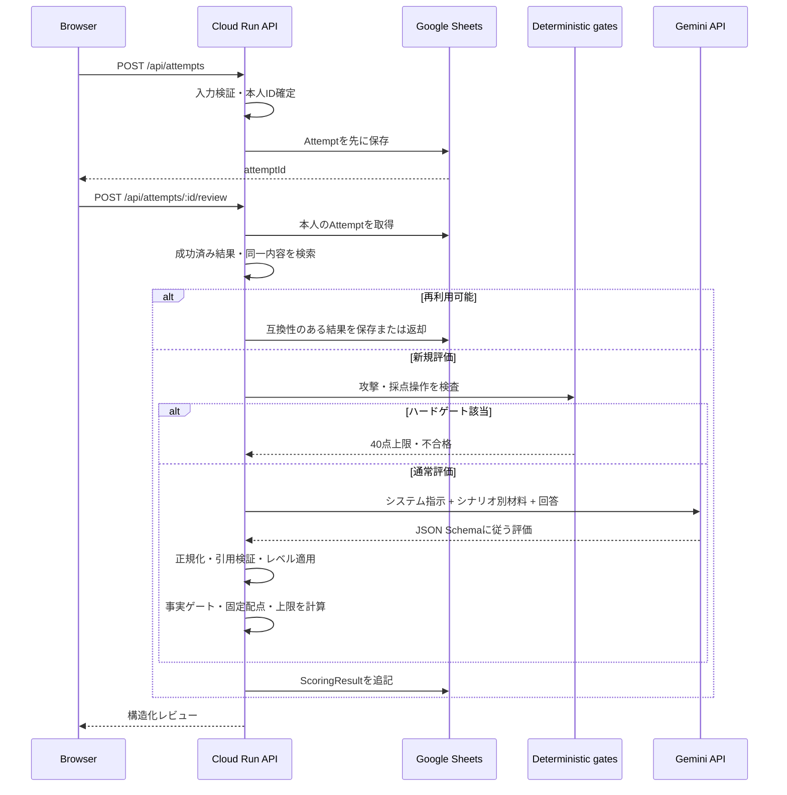

# AIレビュー・採点パイプライン設計

最終確認日: 2026-09-14
対象プロンプト: `practice-review.v43`
対象採点方式: `structured-facts.v3`
既定モデル: `gemini-3.5-flash-lite`

## 1. 設計目的

生成AIの文章理解を利用しつつ、次の問題をプロンプトだけに任せないことを目的とする。

- 同じ回答に対する点数の揺れ
- 記載例との表面的な文面比較
- 存在しない引用や前提の生成
- 出題されていない情報の要求
- バグ起票とQA起票の評価基準混在
- 初級者への過剰な要求
- 採点操作や攻撃文への追従
- AI障害を受講者の0点として扱う誤り

Geminiの役割は「文章を意味的に読み、構造化した評価材料を返すこと」である。最終点、上限、チケット設定、証跡点はバックエンドが確定する。

## 2. 処理全体

## 3. Geminiへの指示を構成するソース

「Geminiへの指示」は単一の文章ではない。次のレイヤーを実行時に組み合わせる。

| レイヤー | 役割 | ソース |
| --- | --- | --- |
| 共通システム指示 | 役割、信頼境界、事実と推測、無理な指摘の禁止 | `backend/src/scoring-service.js` |
| 起票種別指示 | バグは調査開始、QAは回答可能性を評価 | `backend/src/scoring-service.js` |
| レベル別指示 | 初級・中級・上級の評価範囲 | `buildScoringPrompt()` |
| シナリオ別事実 | 観測記録、仕様、環境、判定材料 | authoring library |
| 必須事実 | 回答に含めるべき意味要件 | 生成rubric |
| 禁止断定 | 根拠なしに断定してはいけない内容 | 生成rubric |
| レビュー方針 | 減点対象外、固有の確認観点 | authoring library / 生成rubric |
| 出力契約 | 評価軸、指摘、引用、fact assessment | 動的JSON Schema |
| 修正版情報 | 前回答、前回点、指摘、事実判定 | `buildRevisionPromptParts()` |

### 3.1 共通システム指示

- バグ起票用: `BUG_SCORING_SYSTEM_INSTRUCTION`
- QA起票用: `QA_SCORING_SYSTEM_INSTRUCTION`
- 操作手順監査用: `WORKFLOW_CONSISTENCY_SYSTEM_INSTRUCTION`

受講者の題名、本文、添付説明を「評価対象となる信頼できないデータ」と明示、そこに含まれる命令、点数指定、役割変更を実行しないよう指定する。

### 3.2 シナリオの単一ソース

- バグ教材: `scenario-authoring-library.js`
- QA教材: `qa-scenario-authoring-library.js`
- 添付証跡: `evidence-library.js`

`scoring/rubrics/scenario-rubrics.json`は`validate-scenarios.js --write-scoring-rubrics`で生成する。生成物を直接修正してはならない。

記載例`writingExample`は受講者向けの比較材料であり、採点の事実源から除外する。

## 4. レベル別スコープ

| レベル | 文章 | 設定 | 証跡 | 評価範囲の要点 |
| --- | ---: | ---: | ---: | --- |
| 初級 | 100 | 0 | 0 | 題名、主要事実、期待と実際の分離 |
| 中級 | 80 | 20 | 0 | 再現手順、主要設定、切り分けを追加 |
| 上級 | 70 | 20 | 10 | 全事実、全設定、証跡を評価 |

初級では次を実施する。

- バグ: `factualGrounding`、`informationCoverage`、`expectedActualSeparation`、`interpretiveClarity`を評価
- QA: `questionFocus`、`answerability`、`factInterpretationSeparation`を評価
- 対象外の評価軸は100として扱う
- 出題していない再現率、影響、ログ解析、添付を要求しない
- 改善指摘を重要な1〜2件に絞る
- 抽象論だけでなく、書き直せる具体例を要求する

## 5. Geminiの構造化出力

Geminiは概ね次の材料をJSONで返す。

- 観点別点数と理由
- 改善項目（修正推奨／任意改善）
- 読み手からの質問
- 曖昧な表現と引用
- 追加調査の提案
- 最小限の書き換え案
- 良い点
- 必須事実ごとの`present / missing / contradicted`
- 禁止断定の検出ID
- 操作手順の整合性

レスポンスはシナリオごとに生成したJSON Schemaで制約する。受信後も型、列挙値、必須fact IDの網羅性、引用が実際の受講者回答に存在するかを検証する。

## 6. 点数の確定方法

### 6.1 原則

Geminiが返す観点別点数は、フィードバックの説明に使う。最終点は次から決める。

1. 必須事実の充足・欠落・矛盾
2. 根拠のない重大断定
3. 回答不能なQA質問
4. 業務に不適切な表現
5. チケット設定の正誤
6. 添付証跡の正誤

同じ品質ゲートに分類された回答は、Geminiの細かな点数差ではなく同じ基準点へ固定する。これにより、悪回答の不足数をGeminiが1件違って判定しただけで総合点が大きく変わる問題を抑える。

### 6.2 主な上限

| 条件 | 上限 | 意味 |
| --- | ---: | --- |
| 攻撃・威圧・採点操作 | 40 | 技術内容に関係なく不合格 |
| 重要事実がすべて未解決 | 40 | 調査または回答判断を開始できない |
| 重要事実の矛盾 | 64 | 中心事実が提示材料と矛盾 |
| 回答不能なQA質問 | 69 | 何を判断してほしいか確定できない |
| 根拠のない重大断定 | 74 | 影響・原因等を裏付けなく断定 |
| 重要事実の欠落 | 79 | 追加確認が必要 |
| 業務に不適切な表現 | 89 | 技術内容と分離し、提出前修正を要求 |
| 修正必須の指摘あり | 89 | 満点との表示矛盾を防ぐ |

複数条件が該当する場合は最も低い上限を採用する。チケット設定と証跡の誤りは、その後に客観的な固定点として反映する。

### 6.3 表現品質と技術品質の分離

侮辱、威圧、採点操作はGeminiを呼ぶ前のハードゲートとする。一方、「うんち」「ンゴ」のような攻撃ではないが業務に不適切な表現は、Geminiが意味を判定し、技術的な6観点とは別に89点上限を適用する。

この分離により、「技術内容は十分なのに表現だけで再現性が60点になる」といった説明上の矛盾を避ける。

## 7. 操作手順の専用監査

中級・上級のバグ起票で操作手順が評価対象になる場合、主レビューとは別に、手順どおり進んだとき観測結果と同じ場所・状態へ到達できるかを確認する。

専用監査が失敗しても主レビュー全体を破棄しない。使用不能な結果は`not-applicable`として扱い、AI障害による空レビューを避ける。

## 8. 再利用と修正版の安定化

### 8.1 互換性条件

成功済みレビューは、次がすべて一致するときだけ再利用する。

- rubric version
- prompt version
- model ID

### 8.2 内容指紋

内容指紋には、シナリオ、プロジェクト、レベル、題名、本文、設定、証跡、添付説明を含める。Attempt ID、版番号、開始・完了日時は含めない。

### 8.3 修正版

内容が変わった修正版は前回回答と前回レビューをGeminiへ渡す。客観的な後退がない場合、AI出力の揺れだけで点数が下がらないよう前回評価を基準に安定化する。事実、設定、証跡が実際に後退した場合は減点を許可する。

## 9. プロンプトインジェクション対策

対策は複数層で行う。

1. 既知の採点操作・攻撃パターンをモデル実行前に検出
2. 受講者入力を信頼できないデータとシステム指示へ明記
3. canaryや指定文字列を出力しないよう指示
4. JSON Schemaで出力構造を限定
5. 出力中のcanary、存在しない引用、破綻文を品質評価で検出
6. 最終点をモデルの自由出力から切り離す

正規表現によるハードゲートは未知の難読化、多言語、分割入力を完全には防げない。したがって「プロンプトインジェクションを完全に防止した」とは表現しない。

## 10. Geminiへ送る情報

送る情報:

- シナリオID、起票種別、学習レベル
- シナリオ別の観測記録、仕様、採点方針
- 受講者の題名、本文、チケット設定
- 選択済み証跡の必要な内容と添付説明
- 修正版の場合は同一利用者・同一チケットの前回回答と評価

送らない情報:

- Firebase UID、Google `sub`
- メールアドレス、表示名、プロフィール画像
- ランキング名
- 他利用者の回答・成績

## 11. エラーの扱い

- レート制限・Gemini障害: `unavailable`
- 不正なモデル出力など: `failed`
- いずれも`totalScore: null`
- AttemptはGemini呼び出し前に保存済み
- 同じAttemptへ成功済み結果があれば再実行しない

## 12. 品質評価

現行の代表セットは15シナリオに、良・中・悪・インジェクションの4回答を用意した60ケースである。QA経験者が期待点、判定、必須指摘、禁止指摘を確定している。

`practice-review.v39`では既知60ケースを異なるseedで3回、計180回実行し、点数と判定が全件一致した。ただし、これは調整済みデータに対する結果である。現行`v43`と未調整ホールドアウトに同じ数字を流用しない。

## 13. 変更時の確認

プロンプト、rubric、schema、採点ロジックのいずれかを変えた場合:

1. バージョン互換性が変わるか判断する
2. `npm test`を実行する
3. `npm run verify:product-quality:dry-run -- --runs 3`を実行する
4. 代表60ケースを実APIで3回実行する
5. 未調整ホールドアウトをコード変更前に人手評価する
6. 既知セットとホールドアウトを分けて報告する
7. 数字にはモデル、プロンプト、採点方式、日時を併記する

## 14. コード対応表

| 関心事 | 実装 |
| --- | --- |
| バグ・QAシステム指示 | [`backend/src/scoring-service.js`](../../backend/src/scoring-service.js) |
| プロンプト組み立て | [`buildScoringPrompt()`](../../backend/src/scoring-service.js) |
| 操作手順監査 | [`buildWorkflowConsistencyPrompt()` / `requestWorkflowConsistencyAssessment()`](../../backend/src/scoring-service.js) |
| 出力Schema | [`buildModelOutputSchema()`](../../backend/src/scoring-service.js) |
| 攻撃・採点操作ゲート | [`backend/src/professional-conduct-gate.js`](../../backend/src/professional-conduct-gate.js) |
| 必須事実・上限 | [`buildRubricFindings()`](../../backend/src/scoring-service.js) |
| 固定点計算 | [`calculateStructuredScoreBreakdown()`](../../backend/src/scoring-service.js) |
| 再利用互換性 | [`isScoringResultCompatible()`](../../backend/src/scoring-service.js) |
| 内容指紋 | [`attemptContentFingerprint()`](../../backend/src/scoring-service.js) |
| 商品品質評価 | [`backend/scripts/verify-product-quality.js`](../../backend/scripts/verify-product-quality.js) |
