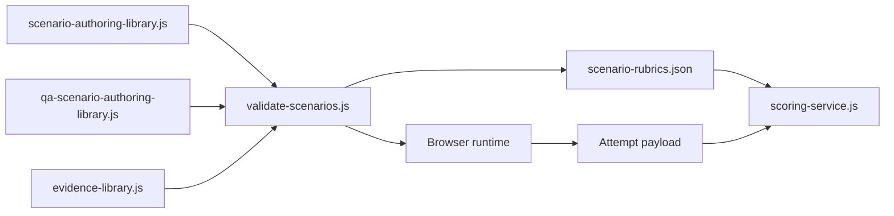
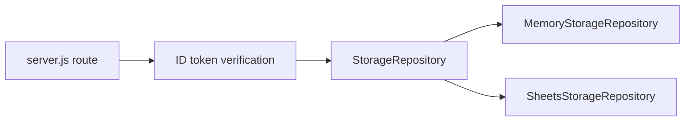
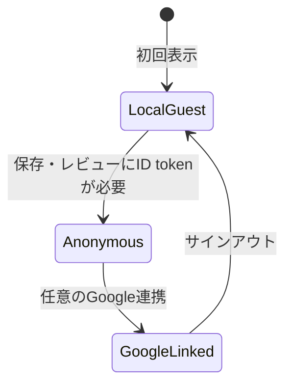

# 実装トレーサビリティ

最終確認日: 2026-09-14
目的: 画面、ユーザーフロー、API、保存データ、テストの対応を現行実装から追跡できるようにする

## 1. 画面からバックエンドまで

| ユーザー操作・画面 | フロント実装 | API | 保存・結果 |
| --- | --- | --- | --- |
| Welcomeで目的を理解する | `welcome.html`, `welcome.js` | なし | なし |
| ゲストでアプリを開く | `auth-client.js`, `main.js` | 初期表示ではなし | ローカルゲスト |
| バグ／QA起票を選ぶ | `showTrainingLevelSelection()` | なし | 画面状態 |
| レベルを選ぶ | `handleTrainingLevelSelect()` | 必要時`GET /api/progress` | 未挑戦優先選択 |
| シナリオ材料を読む | `renderScenarioBrief()` | なし | authoring library |
| 見本入力を行う | `startSession()`, typing render functions | なし | セッション内結果 |
| 実践起票を書く | `renderPracticeSubject()`, `renderPracticeReport()` | なし | localStorage下書き |
| チケット設定を選ぶ | `getPracticeTicketFieldPayload()` | なし | 作成payload |
| 証跡を選ぶ | evidence render functions | なし | 選択ID・説明 |
| 起票を保存する | result作成処理, `profile-api.js` | `POST /api/attempts` | Attempts |
| AIレビューを受ける | `renderPracticeScoringPreview()` | `POST /api/attempts/:id/review` | ScoringResults |
| 修正版を保存する | `beginTicketRevision()`周辺 | `POST /api/tickets/:id/revisions` | 同じticket IDの新Attempt |
| チケット一覧を見る | `loadTicketList()` | `GET /api/tickets` | 本人の最新版 |
| 版履歴を見る | `loadTicketDetail()` | `GET /api/tickets/:id` | 本人の全revision |
| 進捗を見る | `loadMyPageTab()` | `GET /api/progress` | シナリオ別集計 |
| 履歴を見る | `loadMyPageTab()` | `GET /api/history` | 本人のAttempt履歴 |
| ランキングを見る | `renderMyPageRanking()` | `GET /api/leaderboard` | オプトイン公開名のみ |
| Google連携する | `auth-client.js` | `POST /api/identity/claim` | ゲスト履歴を統合 |

## 2. URLと画面状態

| URL | 画面 |
| --- | --- |
| `/` | Welcome・サービス説明・開始導線 |
| `/app.html#/tickets` | 実践起票のチケット一覧 |
| `/app.html#/tickets/{ticketId}` | チケット詳細・版履歴・AIレビュー |
| `/app.html#/mypage/progress` | 学習進捗 |
| `/app.html#/mypage/history` | 挑戦履歴 |
| `/app.html#/mypage/ranking` | ランキング・公開設定 |
| `/bug-report-writing` | 不具合報告の公開ガイド |
| `/qa-question-writing` | QA確認の公開ガイド |

レベル選択、シナリオ説明、見本入力、実践起票、結果は、`app.html`内の画面状態として切り替える。

## 3. 教材データの流れ

| データ | 正本 | 生成・利用先 |
| --- | --- | --- |
| バグ問題文・記載例・観測事実 | `scenario-authoring-library.js` | 画面、生成rubric |
| QA問題文・記載例・確認材料 | `qa-scenario-authoring-library.js` | 画面、バックエンドrubric構築 |
| 添付証跡 | `evidence-library.js` | 画面、バグrubric |
| バグシナリオ別rubric | authoring libraryから生成 | `scoring/rubrics/scenario-rubrics.json` |
| Gemini出力形式 | `scoring-service.js`の動的Schema | Gemini API |
| 永続レコード形式 | `scoring/schemas/*.json` | API、Sheets |

## 4. APIから保存層まで

画面はSheetsの列、タブ、行番号を知らない。`StorageRepository`が契約を定め、ローカルテストと本番で実装を交換する。

## 5. AIレビューのトレース

| 工程 | 実装 | 主なテスト |
| --- | --- | --- |
| 攻撃・採点操作検出 | `professional-conduct-gate.js` | `professional-conduct-gate.test.js` |
| プロンプト構築 | `buildScoringPrompt()` | `scoring-service.test.js` |
| 操作経路監査 | `requestWorkflowConsistencyAssessment()` | `scoring-service.test.js` |
| Gemini出力正規化 | `normalizeModelOutput()` | `scoring-service.test.js` |
| 必須事実・上限 | `buildRubricFindings()` | `scoring-service.test.js` |
| 固定点計算 | `calculateStructuredScoreBreakdown()` | `scoring-service.test.js` |
| 再利用・互換性 | fingerprint / compatibility functions | `scoring-service.test.js` |
| gold set比較 | product quality evaluator | product quality tests |

## 6. 認証状態のトレース

- `LocalGuest`: Firebaseアカウント未作成。端末内で開始可能
- `Anonymous`: Firebase UIDでサーバー保存可能
- `GoogleLinked`: 同じFirebase UIDへGoogle identityをリンク
- 既存Google連携アカウントがある場合、検証済みの匿名履歴を統合する

## 7. テストと仕様の対応

| 要件 | 検証 |
| --- | --- |
| 全120シナリオが登録済み | `node validate-scenarios.js` |
| 公開物に内部資料を含めない | `scripts/verify-dist.mjs` |
| API認証・本人スコープ | backend auth / storage tests |
| 保存後にAI障害が起きてもAttemptを残す | scoring service tests |
| 初級で上級内容を要求しない | scoring service tests |
| 攻撃文をGemini実行前に拒否 | conduct gate / scoring tests |
| 同一内容を再利用 | scoring service tests |
| Sheetsとメモリ実装が同じ契約を満たす | storage repository tests |
| AI品質を人間期待と比較 | product quality evaluator |

## 8. 更新ルール

次の変更ではこの文書も更新する。

- 画面ルートまたは主要導線を追加・削除
- API endpointを追加・変更
- 保存record schemaを変更
- authoring libraryの正本関係を変更
- 認証状態・統合方法を変更
- AI採点工程またはバージョン互換性を変更
