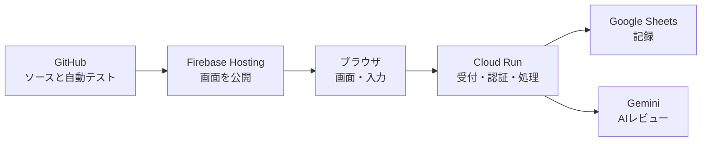

# あかマイン ポートフォリオ説明ガイド

最終確認日: 2026-09-14

この資料は、設計情報を暗記するためではなく、「なぜ作ったか」「なぜその技術を選んだか」「どこに難しさがあったか」を自分の言葉で説明するための台本である。

公開用資料へ転用する場合は、APIキー、OAuthクライアントID、Google Cloudのプロジェクト番号、Spreadsheet ID、サービスアカウント名を載せない。

## 1. 一言で説明する

> あかマインは、未整理の不具合情報から、開発者に伝わるバグチケットを作る力を鍛えるWebトレーニングサービスです。

「AIが文章を書いてくれるサービス」ではない。利用者が自分で起票し、AIは読み手として不足や曖昧さを返す。

## 2. 30秒説明

> QAでは不具合を見つけるだけでなく、開発者が調査できる形で伝える力が必要です。あかマインでは、現場メモやログなどの断片情報から、利用者自身がRedmine風の画面でバグチケットを作成します。作成後はGeminiが、事実性、情報充足、再現性など6つの観点からレビューします。画面はFirebase Hosting、APIはNode.jsとCloud Run、保存はGoogle Sheets、認証はGoogleログインで構成しています。

## 3. 1分説明

> あかマインは、バグ報告の「書き方」ではなく「情報を整理して伝える力」を訓練するサービスです。見本入力では完成したチケットの構成を覚え、実践起票では、未整理のメモから題名、再現手順、期待結果、実際の動作、備考を自分で組み立てます。
>
> 実践起票はGoogleログインなしでも開始でき、保存時に必要ならFirebase匿名アカウントを作成します。Cloud Run上のNode.js APIからGeminiへレビューを依頼しますが、AIへ点数を丸投げしていません。Geminiには必須事実の状態と改善指摘を構造化して返させ、バックエンドが品質ゲート、チケット設定、証跡選択から表示点を確定します。結果はGoogle Sheetsへ保存し、履歴、進捗、ランキングで確認できます。
>
> フロントエンドはGitHubのmainブランチへpushすると、テスト後にFirebase Hostingへ自動デプロイされます。APIキーはSecret Managerに置き、ブラウザへ公開しない構成にしています。

## 4. システムを簡単に説明する



説明するときはサービス名を並べるのではなく、役割から話す。

- Firebase Hostingは「画面を配る場所」
- Cloud Runは「保存やAI連携を処理するサーバー」
- Node.jsは「サーバーでJavaScriptを動かす環境」
- Dockerは「バックエンドを同じ状態で運ぶ箱」
- Google Sheetsは「現在のデータ保存先」
- Geminiは「文章を確認する読み手」
- Secret Managerは「APIキーを守る金庫」

## 5. なぜ作ったのか

### 課題

- バグを発見しても、報告内容が曖昧だと開発者が再現・調査できない
- テンプレートを知っているだけでは、未整理情報から文章を組み立てられない
- 実務に近い起票練習と、具体的なフィードバックを受ける場所が少ない

### 解決方法

- Redmine風UIで実務に近い入力を再現
- 完成文ではなく、現場メモ、仕様、ログなどの断片を提示
- 見本入力と実践起票を分離
- AIを代筆者ではなくレビュー担当として利用
- 改善前後を修正版として残し、学習過程を確認可能にする

## 6. 技術選定を説明する

### Firebase Hostingを選んだ理由

> フロントエンドが静的なHTML、CSS、JavaScriptなので、サーバーを常時管理せず高速に配信でき、独自ドメインとHTTPSも設定しやすいためです。

### Cloud Runを選んだ理由

> Gemini APIキーをブラウザへ置かず、認証確認、保存、AI連携をサーバー側で行う必要がありました。Cloud RunならDocker化したNode.js APIを動かせ、アクセスが少ない間は最小インスタンスを0にして費用を抑えられるためです。

### Node.jsを選んだ理由

> フロントエンドとバックエンドをJavaScriptで統一でき、小規模開発で言語を切り替える負担を減らせるためです。PHPが使えないのではなく、このサービスではNode.jsが自然でした。

### Google Sheetsを選んだ理由

> 初期段階では利用者数が少なく、データを直接確認しやすく、短期間で検証できるためです。ただし、規模が増えると同時アクセスや検索性能が問題になるので、永続化処理をRepositoryとして分離し、将来データベースへ交換できる設計にしています。

### Geminiを選んだ理由

> 正解文との単純一致では評価できない、情報の不足、曖昧さ、再現性を文章としてレビューする必要があったためです。

## 7. AIレビューで工夫したこと

ここがポートフォリオ上の重要点である。

### AIへ丸投げしていない

Geminiへ「100点満点で採点して」と頼むだけでは、採点が不安定になる。そのため次を実装した。

1. シナリオごとに必須事実と禁止する断定を定義
2. 6つの評価軸と重みを定義
3. Geminiの返答形式をJSON Schemaで制限
4. バックエンドで形式を検証
5. バックエンドで事実ゲートと客観項目から表示点を計算
6. 重大情報の欠落・矛盾がある場合は点数上限を適用
7. 成功、失敗、利用不可を区別し、API障害を0点にしない

### 6つの評価軸

- 事実性
- 情報充足
- 再現性
- 期待結果と実際の動作の分離
- 解釈の明瞭さ
- 次の切り分けへのつながり

### 自動検証

代表15シナリオに対して、良・中・悪・インジェクションの4回答、合計60件をQA経験者が確認したgold setとして用意した。`practice-review.v39`では各回答を3回、合計180回を実Gemini APIで検証し、既知ケースの点数と判定が完全一致した。

説明例：

> 生成AIは同じ入力でも結果が揺れます。実際に旧方式では、悪回答の点数安定率が33.3%でした。そこで、プロンプト調整だけでなく、構造化した事実判定とサーバー側の固定配点へ変更しました。v39では既知60回答を3回ずつ評価し、点数と判定が全件一致しました。ただし、現行v43と未調整ホールドアウトの同等精度はまだ確認中です。

## 8. セキュリティで工夫したこと

説明できるようにするポイント：

- Gemini APIキーをHTMLやJavaScriptへ埋め込まない
- APIキーはSecret Managerへ保存
- ブラウザはGoogle IDトークンをCloud Runへ送る
- Cloud Runでトークンを毎回検証
- 利用者が送ったユーザーIDを信用しない
- Google Sheetsは専用サービスアカウントだけが編集
- Geminiへ氏名、メールアドレス、GoogleユーザーIDを送らない
- 本番ではFirestoreを使い、利用者・IP・サービス全体のAIレビュー回数をインスタンス間で制限

説明例：

> ブラウザからGeminiを直接呼ぶとAPIキーが見えるため、必ずCloud Runを経由させています。また、ユーザーIDはリクエストから受け取らず、検証済みGoogleトークンからサーバー側で決めています。

## 9. デプロイを説明する

### フロントエンド

```text
ローカルで修正
  ↓
npm run verify
  ↓
git commit / git push
  ↓
GitHub Actionsが自動テスト
  ↓
Firebase Hostingへ自動公開
```

### バックエンド

```text
Node.jsのAPIを修正
  ↓
DockerfileからCloud Buildがイメージを作成
  ↓
Cloud Runへ新しいリビジョンを公開
```

フロントエンドは自動デプロイ、Cloud Runは現在手動デプロイである。ここを曖昧に説明しない。

## 10. 自分が担当したことの説明

事実より大きく見せない。特に、AIコーディング支援を使ったのに「全コードを自力で手書きした」と説明するのは逆効果になる。

推奨する説明：

> 私は、サービス企画、要件整理、画面・UXの判断、シナリオ設計、AIの評価観点、クラウド構成、受け入れ確認を主導しました。実装ではAIコーディング支援も使用しています。ただし、生成結果をそのまま採用せず、画面確認、エラー調査、テスト条件、セキュリティ方針、採点結果の妥当性を判断しながら改善しました。

これなら、AIを使った事実を隠さず、プロダクトオーナー・設計者・実装責任者としての価値を説明できる。

## 11. 苦労した点と解決

### Googleログインの`origin_mismatch`

- 原因: Google OAuthに本番・ローカルのオリジンが登録されていなかった
- 対応: 承認済みJavaScript生成元を環境ごとに登録
- 学び: 認証はコードだけでなく、クラウド側設定まで含めて成立する

### 独自ドメインとSSL

- 原因: DNS反映と証明書発行に時間差があった
- 対応: Firebase指定のA、CNAME、TXTを登録し、証明書発行を待って確認
- 学び: DNSとHTTPSはアプリコードとは別レイヤーの作業

### AIレビュー対象外・400エラー

- 原因: シナリオ定義と採点ルーブリックの対応漏れ
- 対応: シナリオIDとルーブリック登録を照合し、自動検証対象を拡張
- 学び: AI機能も通常のソフトウェアと同じく、入力契約と回帰テストが必要

### APIキーと課金

- 課題: APIキーを安全に保管し、想定外課金を防ぐ必要があった
- 対応: Secret Manager、利用上限、レート制限、旧キー無効化
- 学び: AI導入はモデル呼び出しだけでなく、秘密管理と費用管理までが実装範囲

## 12. 弱点を正直に説明する

現状の主要な弱点は次の4点である。

1. 保存先がGoogle Sheetsであり、大規模利用には向かない
2. Cloud Runバックエンドのデプロイがまだ手動
3. 現行v43の代表60回答に対する全実API回帰結果がまだ文書化されていない
4. 未調整ホールドアウト20回答の人手評価が未完了

説明例：

> 現在は仮説検証を優先してGoogle Sheetsを採用しています。利用者が増えた場合はPostgreSQLまたはFirestoreへ移行します。画面を保存方式へ直接依存させず、Repositoryを交換できる構造にしています。また、フロントエンドは自動デプロイ済みですが、バックエンドは影響範囲が大きいため現在は手動確認を残しています。AI品質は既知ケースで検証していますが、現行版と未調整データの検証は未完了なので、人事評価に使える精度とは説明しません。

弱点を隠すより、制約を理解して次の設計を用意している方が評価される。

## 13. よく聞かれる質問

### Q. なぜAIに正解文を作らせないのですか？

> このサービスの目的は利用者が考えて書くことだからです。AIが代筆すると訓練にならないため、AIは読み手として質問や改善点を返す役割に限定しています。

### Q. なぜGoogle Sheetsなのですか？

> 初期検証の速度と確認しやすさを優先したためです。大規模運用には向かないことを理解した上で、将来のDB移行を前提に保存層を分離しています。

### Q. FirebaseとCloud Runの違いは？

> Firebase Hostingは画面ファイルを配信し、Cloud Runは認証、保存、AI連携などサーバー処理を行います。

### Q. Dockerはどこで使っていますか？

> Cloud RunのNode.jsバックエンドを梱包するために使っています。Firebase Hostingでは使っていません。

### Q. PHPではだめですか？

> PHPでも実装できます。今回は画面とサーバーをJavaScript系で統一でき、Cloud Runとの相性もよいためNode.jsを選びました。

### Q. Geminiが変な点数を返したらどうしますか？

> 出力形式を制限し、サーバーで検証・再計算しています。また、シナリオ別の期待条件を使った自動検証を行います。API障害は0点にせず失敗として保存します。

### Q. 他人の履歴を見られませんか？

> APIはGoogleトークンから本人IDを確定し、そのIDのデータだけを検索します。リクエストに書かれたユーザーIDは使用しません。

## 14. デモの見せ方

ポートフォリオでは、画面を順番にクリックするだけでは弱い。次の順序で「設計意図」を説明する。

1. Welcomeでサービスの目的を一言で説明
2. 見本入力でチケット構成を覚える流れを見せる
3. 実践起票で未整理情報から自分で組み立てる違いを見せる
4. AIレビューで6軸評価と具体的な質問を見せる
5. 修正版で改善前後を残せることを見せる
6. マイページで継続学習を見せる
7. 最後にFirebase、Cloud Run、Sheets、Geminiの構成を説明する

## 15. 説明前チェックリスト

- [ ] 一言説明を暗記ではなく自分の言葉で言える
- [ ] FirebaseとCloud Runの役割を区別できる
- [ ] Node.js、Docker、Cloud Runの関係を説明できる
- [ ] AIへ点数を丸投げしていない理由を説明できる
- [ ] APIキーをブラウザへ置かない理由を説明できる
- [ ] Google Sheetsを選んだ理由と限界を説明できる
- [ ] 自動デプロイと手動デプロイの違いを説明できる
- [ ] AIコーディング支援をどう管理したか説明できる
- [ ] 次に改善する項目を説明できる
