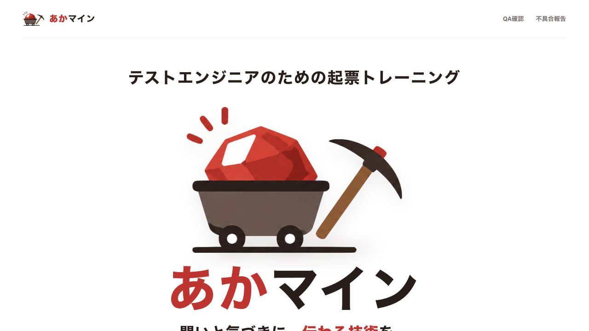

# あかマイン Case Study

最終確認日: 2026-09-14

## Summary

あかマインは、現役のテストエンジニアが「不具合を見つけた後、他者が動ける形で伝える力」を反復練習するWebサービスである。転職対策ではなく、実務で使う起票力の維持・向上と、チーム内のレビュー観点の標準化を主な用途とする。

受講者は架空の業務システムで得られた現場メモ、仕様、確認結果、証跡から、Redmine風の画面でバグ起票またはQA起票を作成する。Geminiは代筆せず、開発者・仕様担当者の読み手視点からレビューする。

## Problem

バグ報告のテンプレートは多数存在する。しかし実務で難しいのは見出しを覚えることではなく、次の判断である。

- 断片情報のうち、何をチケットへ書くか
- 観測した事実と推測をどう分けるか
- 期待結果と実際の動作をどう対比するか
- 再現担当者が同じ状態へ到達できるか
- QA質問で誰に何を判断してほしいか

文章添削AIへ回答を作らせるだけでは、この判断を練習できない。

## Product approach

### 実務に近い入力体験

- バグ起票とQA起票を分離
- 顧客管理、勤怠、EC、車載、決済、医療など10領域
- 初級・中級・上級で情報量と評価範囲を段階化
- Redmine風のチケット項目と証跡選択
- 初版と修正版を同じチケットの版として保存

### 学習と評価の分離

- 見本入力: 完成例からチケットの型を学ぶ
- 実践起票: 正解文を隠し、未整理情報から自分で作る
- AIレビュー: 不足、矛盾、曖昧さ、良い点を返す
- 記載例比較: 採点後に任意で確認する

## Hardest problem: AI評価の安定性

### 発見した問題

最初はGeminiの6観点点数を重み付けして総合点を計算していた。代表60回答を3回ずつ評価したところ、判定は一致したが、悪回答の点数安定率は33.3%で、同一回答が最大40点変動した。

ユーザーが改善していないのに点数が変わる状態では、学習サービスとして成立しない。

### 判断

プロンプトをさらに細かくするだけではなく、点数設計そのものを変更した。

1. シナリオごとに重要事実と禁止断定を定義
2. Geminiに各事実を`present / missing / contradicted`で返させる
3. 重要な欠落・矛盾から決定論的な品質ゲートを選ぶ
4. 同じゲートは同じ基準点へ固定
5. チケット設定と証跡だけを固定点で反映
6. Geminiの観点別点数は説明用に限定

### 結果

`practice-review.v39`の既知60回答×3回では、点数・判定とも60/60ケースで完全一致し、最大点差は0になった。

ただし、これは調整済みデータに対する結果である。現行v43と未調整ホールドアウトの同等精度は確認中であり、「AI採点は100%正確」とは結論づけていない。

## Other design decisions

### AIレビューの前に保存する

Gemini障害で入力まで失わないよう、Attempt保存とレビューを別APIにした。失敗は0点ではなく`unavailable / failed`として扱う。

### 認証を開始障壁にしない

初回はローカルゲストとして開始し、保存が必要になった時点でFirebase匿名アカウントを作成する。Google連携は履歴保持と別端末利用のための任意操作にした。

### Sheetsを直接画面へつながない

初期検証ではGoogle Sheetsを採用したが、ブラウザはCloud Run APIだけを呼ぶ。保存方式をRepositoryの背後へ置き、認証情報と物理列を画面から切り離した。

### 攻撃文と不適切表現を分ける

威圧、侮辱、採点操作はモデル実行前に不合格とする。攻撃ではないが業務に不適切な語句は、技術内容の6観点を壊さず、提出前修正として89点上限を適用する。

## Quality assurance

### 現行コードで確認したこと

- バグ60・QA60の全120シナリオ整合性
- 10プロジェクトの教材、仕様、担当、環境、日程の対応
- 公開成果物49ファイルと内部ファイル除外
- バックエンド120テスト
- 人手gold set 60回答の構造検証
- 公開サービスのゲスト状態で、上級バグ起票の保存からAIレビュー完了まで確認

### AI品質で分けて測ったこと

- 自動品質異常
- 人間期待点との誤差
- 人間判定との一致
- 必須指摘の再現率
- 禁止指摘の発生率
- 攻撃回答の拒否
- 同一回答の点数・判定安定性

## Security and operations

- Gemini APIキーはSecret ManagerからCloud Runへ注入
- IDトークンをバックエンドで検証
- ユーザーIDをリクエスト本文から採用しない
- 利用者・IP・サービス全体の採点上限をFirestoreで共有
- Geminiへ認証ID、メール、表示名を送らない
- 公開ビルドへ`.env`、バックエンド、内部rubricを含めない
- ゲストデータをFirebase Authの削除状態と照合して定期削除

残存リスクとして、自由入力への実在個人情報混入、CSP未設定、未知のインジェクション、Sheetsのスケール限界がある。

## What I would do next

1. QA担当者が未調整ホールドアウト20回答をブラインド評価する
2. 現行v43の代表60回答とホールドアウトを各3回実API評価する
3. 初心者5人程度で、AI指摘を読んで自力修正できる割合を測る
4. 入力・結果画面のXSS回帰テストとCSPを追加する
5. 利用ログから離脱箇所と高頻度シナリオを特定する
6. B2B需要が確認できてから受講管理・レポートを設計する

## Role and use of AI coding assistance

制作者は、サービス企画、学習要件、シナリオ設計、評価観点、クラウド構成、QA受け入れを主導した。実装にはAIコーディング支援を利用している。

価値はコードを手入力した量ではなく、生成結果の矛盾を検出し、実測データとQA判断から評価方式を変更し、セキュリティ・コスト・運用を含めて製品へ統合した点にある。
