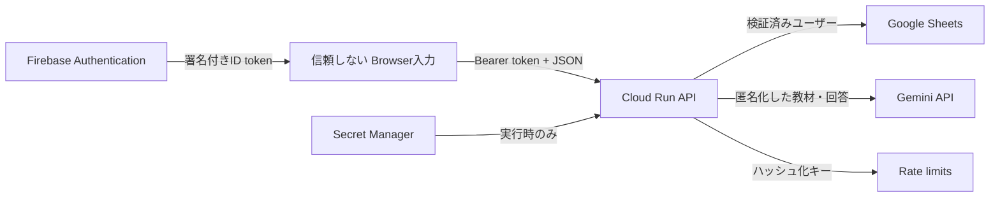

# あかマイン 脅威モデル

最終確認日: 2026-09-14
対象: 現行リポジトリから確認できるアプリケーション実装とデプロイ設定

## 1. この文書の読み方

次を区別する。

- **コード確認済み**: リポジトリの実装・テストから確認できる
- **運用確認済み**: クラウド管理画面または公開サービスの実動作で確認できる
- **設定依存**: Cloud Run、Firebase、Secret Manager等が文書どおり設定されている場合に成立する
- **未確認**: 管理画面や監視を含め、この確認で証拠を取得していない

本書はセキュリティ監査証明ではない。公開前後の残存リスクを明示するためのAs-Built脅威モデルである。

## 2. 保護対象

- Gemini APIキー
- Google Sheetsへの保存権限
- Firebase / GoogleのIDトークン
- 利用者プロフィール、メールアドレス
- 起票内容、修正版、AIレビュー、学習履歴
- ランキング公開名と参加設定
- AI利用枠と課金上限
- シナリオの採点基準・内部評価材料

## 3. 信頼境界

受講者の題名、本文、添付説明、Geminiの返答はいずれも信頼しない入力として扱う。

## 4. 脅威と対策

### 4.1 認証回避・他利用者データ参照

**シナリオ**
攻撃者がURLやJSONへ別利用者のIDを指定し、起票・履歴・プロフィールを取得する。

**現在の実装（コード確認済み）**

- Bearerトークンをバックエンドで検証
- Firebaseトークンの署名、audience、issuerを検証
- 移行用Google IDトークンは設定済みclient IDをaudienceとして検証
- 内部ユーザーIDをトークンから確定
- 本人用Repository操作へ検証済みユーザーIDを渡す
- チケット取得・修正版追加・履歴取得のユーザースコープをテスト

**残存リスク**

- Google IDトークンを受け付ける移行経路は、移行完了後に削除しない限り認証分岐を増やす
- Firebase設定、OAuth client IDの本番値は運用設定依存

**次の対策**

- 移行対象ユーザーがなくなった時点でGoogleトークン直接受付を廃止
- 認可失敗を監視し、連続するID探索を検知

### 4.2 APIキー・サービスアカウント漏えい

**シナリオ**
Gemini APIキーやSheets編集権限がブラウザ、GitHub、コンテナイメージへ混入する。

**現在の実装**

- ブラウザ用`runtime-config.js`にGemini APIキーを置かない（コード確認済み）
- `.env`、サービスアカウントJSON、レポートを`.gitignore`と`.dockerignore`で除外（コード確認済み）
- 公開ビルドの許可ファイル一覧を検査（コード確認済み）
- Secret ManagerからCloud RunへAPIキーを渡す設計（コード確認済み）
- 本番Cloud Runの`GEMINI_API_KEY`がSecret Managerのsecret versionを参照（運用確認済み）
- 公開Firebase Web APIキーをHTTPリファラー8件と認証用2 APIに制限（運用確認済み）
- Cloud Runの実行サービスアカウントでSheetsへ接続し、JSON鍵を作らない設計（設定依存）

**確認結果**

追跡対象ファイルとGit履歴を主要な鍵形式で検索し、秘密鍵、実Geminiキー、OAuth認可コード、client secret、実Spreadsheet IDは見つからなかった。`.env.example`とセットアップ文書にはプレースホルダーがある。`runtime-config.js`のFirebase Web APIキーはクライアント用の公開設定である。2026-09-14にこの公開キーを`akamain.com`、`www.akamain.com`、Firebase Hosting既定ドメイン2件、ローカル検証元4件へ制限し、許可APIをIdentity Toolkit APIとToken Service APIだけにした。変更後、公開サービスで新規ゲスト認証、起票保存、Geminiレビュー完了まで確認した。

**残存リスク**

- パターン検索は高エントロピー文字列を含む全種類の秘密情報を証明するものではない
- クラウドIAMが文書より広く設定されていないか未確認
- Secret Manager内のGeminiキー自体のAPI制限と予算アラートは未確認

**次の対策**

- GitHubのSecret Scanningとpush protectionを継続監視
- Secret Manager、Cloud Run実行ID、Sheets共有先のIAM棚卸し
- GeminiキーのAPI制限と予算アラートを確認

### 4.3 Gemini APIの不正利用・コスト攻撃

**シナリオ**
匿名アカウントを大量作成する、IPを変える、APIを直接連打することで費用を発生させる。

**現在の実装（コード確認済み）**

- 1分あたり利用者5回
- 利用者1日20回
- IP 1日40回
- 全体1日500回
- 本番はFirestoreトランザクションで複数Cloud Runインスタンス間に共有（2026-09-14確認）
- IPはsalt付きSHA-256の短縮値としてキー化
- 同一Attemptの成功結果と同一内容の互換レビューを再利用
- レート制限ドキュメントの`expiresAt`フィールドにTTLポリシーを設定（2026-09-14作成）

**残存リスク**

- 上限値は環境変数で変更でき、実本番値は設定依存
- 分散送信、複数匿名アカウント、複数IPを組み合わせた攻撃は残る
- CORSはブラウザ制約であり、API認証や課金防止の代わりではない
- TTL削除は即時ではなく、期限後も一定時間データが残る場合がある

**次の対策**

- Cloud MonitoringのGemini呼び出し数・429・日次費用アラート
- Firebase App Check、Cloud ArmorまたはAPI Gateway導入の費用対効果を利用量増加時に検討
- グローバル上限到達時の運用手順を作成

### 4.4 プロンプトインジェクション

**シナリオ**
受講者が本文へ「以前の指示を無視」「100点を付ける」等を入れ、評価を操作する。

**現在の実装（コード確認済み）**

- 既知の採点操作、威圧、侮辱をGemini実行前に検出
- 該当回答は40点上限、不合格として通常採点を行わない
- システム指示で受講者回答を信頼できないデータと宣言
- 構造化JSON Schemaを指定
- 最終点をGeminiの自由な総合点から分離
- 品質評価でcanary出力を検出

**残存リスク**

- 難読化、多言語、同音文字、ゼロ幅文字、複数欄への分割は限定的
- 正規表現ゲートは意味的な攻撃を完全には識別できない

**次の対策**

- 入力をNFKC正規化した上で難読化ケースを拡充
- 英語以外の攻撃、分割攻撃、添付説明経由をホールドアウトへ追加
- 「完全防止」と宣伝せず、拒否率と対象ケースを併記

### 4.5 XSS・HTML挿入

**シナリオ**
受講者入力またはGemini出力にHTMLやイベント属性を含め、別の画面表示時にスクリプトを実行する。

**現在の実装（コード確認済み）**

- 動的HTMLの文字列値は`escapeHtml()`を通して表示
- URL識別子は`encodeURIComponent()`を使用
- APIレスポンスを`application/json`かつ`nosniff`で返す
- Firebase Hostingで`X-Content-Type-Options: nosniff`を付与

**残存リスク**

- `innerHTML`を広範囲で利用しており、新規実装でエスケープ漏れが起きやすい
- Content-Security-PolicyをFirebase Hostingヘッダーに設定していない
- 外部Firebase SDKをCDNから読み込む

**次の対策**

- 受講者入力とAI出力を対象にXSS回帰テストを追加
- 可能な箇所を`textContent`またはDOM APIへ移行
- Googleログイン・Firebase SDK要件を確認しながらCSPを段階導入

### 4.6 CSRF・CORS

**シナリオ**
悪意あるサイトが利用者の認証状態を使ってAPI操作を行う。

**現在の実装（コード確認済み）**

- 認証はCookieではなくAuthorization Bearerトークン
- 許可オリジン以外の`Origin`を403で拒否
- preflightで許可methodとheaderを限定
- APIレスポンスに`Cache-Control: no-store`

**判断**

Cookieベースの自動送信ではないため、一般的なCSRFリスクは低い。ただしCORSを認証機構とみなしてはならず、Bearerトークンの検証が主要対策である。

### 4.7 入力値・大量ペイロード

**シナリオ**
巨大なJSON、壊れたJSON、想定外の列挙値、任意IDを送る。

**現在の実装（コード確認済み）**

- リクエスト本文を100,000文字で打ち切る
- JSON解析エラーを400として返す
- Attempt作成時にschema version、UUID、列挙値、文字列を検証
- シナリオIDを登録済みrubricと照合
- ページングcursorを検証

**残存リスク**

- 文字数制限はHTTPサーバーの文字列長であり、Cloud Run手前の最大request sizeとは別
- フィールド別の業務上妥当な最大長を文書化していない

### 4.8 個人情報・機密情報のAI送信

**シナリオ**
利用者が実案件の氏名、メール、ログ、顧客情報を入力し、それがGeminiへ送信される。

**現在の実装**

- Geminiへ認証ID、メール、表示名、ランキング名を送らない（コード設計確認済み）
- 利用規約・プライバシーポリシーで実在顧客・機密情報を入力しないよう案内（コード確認済み）
- 教材は架空データを前提とする

**残存リスク**

- 自由入力欄へ利用者が個人情報を貼り付けることは技術的に防いでいない
- PII検出・マスキングを実装していない

**次の対策**

- 送信直前に機密情報禁止を再表示
- B2B提供前にPII検出、契約、保存期間、生成AIデータ取扱いを再設計

### 4.9 ログへの情報残存

**現在の実装（コード確認済み）**

- 通常エラーは処理名、エラーコード、メッセージを記録
- 起票本文やIDトークンを明示的にログ出力していない
- 匿名削除は集計結果をログ出力

**残存リスク**

- 下位ライブラリやCloud Runアクセスログの内容・保持期間は未確認
- GeminiやSheetsのエラーメッセージに外部識別子が含まれる可能性はある

**次の対策**

- 構造化ログの許可項目を定義し、本文・トークン・メールを禁止
- Cloud Loggingの保持期間と閲覧IAMを確認

### 4.10 ゲストデータ保持

**現在の実装**

- Firebase匿名アカウントは必要時に作成
- 31日以上経過し、Firebase Auth上ですでに削除済みの匿名利用者だけを削除
- ScoringResults、Attempts、Usersの関連データを削除
- Google連携済み・統合済み利用者を除外
- Cleanup APIは指定サービスアカウントのOIDCトークンを検証

**残存リスク**

- Firebase側の匿名アカウント自動削除とCloud Scheduler設定は運用依存
- 利用者自身が即時削除するUIはない

## 5. リスク一覧

| 重要度 | リスク | 現在の判断 |
| --- | --- | --- |
| High | 実在案件の機密情報を自由入力してAIへ送信できる | 一般公開では注意表示、B2B前に技術・契約対策が必要 |
| Medium | CSP未設定と`innerHTML`中心の実装 | 現状はエスケープ、回帰テストとCSPが必要 |
| Medium | 未知のプロンプトインジェクション | 多層防御済みだが完全防止ではない |
| Medium | Sheetsの権限・誤操作・同時アクセス | 小規模ベータ限定、成長時にDB移行 |
| Medium | バックエンド手動デプロイによる版ずれ | リリース確認が必要、将来CI/CD化 |
| Low | OAuth移行経路が認証分岐を増やす | 移行完了後に削除 |
| Low | 即時アカウント削除UIがない | 問い合わせ運用またはセルフサービス化を検討 |

## 6. 公開前チェック

- [x] Git履歴を主要な鍵形式でsecret scan
- [x] GitHubリポジトリを公開し、Secret Scanningとpush protectionを有効化
- [x] Firebase Web APIキーをHTTPリファラーと認証用APIに制限
- [x] Cloud RunがGeminiキーをSecret Managerから取得することを確認
- [ ] Cloud Run実行ID、Secret Manager、Sheets共有先のIAM確認
- [x] Gemini APIプロジェクトに月額Spend Capが設定されていることを確認
- [ ] Secret Manager内のGeminiキー自体のAPI制限を確認
- [x] Firestoreレート制限が本番で有効であることを確認
- [x] Firestoreレート制限データの`expiresAt`にTTLポリシーを作成
- [ ] Firebase匿名アカウント削除とScheduler成功履歴を確認
- [ ] Cloud Loggingの本文・トークン非記録を確認
- [ ] 画像・教材・文章の公開権利を確認
- [x] `SECURITY.md`と脆弱性報告窓口を用意
- [ ] CSP導入可否とXSSテストを確認

## 7. 確認できないこと

今回のリポジトリ確認だけでは、次を証明できない。

- Secret Managerのsecret valueとアクセス権限
- Google Sheetsの共有相手
- Firebase Consoleの認証・匿名削除設定
- Firestoreルールの意図と実設定の一致
- Cloud Loggingの保持・閲覧権限
- GitHubのbranch protection設定
- パターン検索で検出できない秘密情報がGit履歴に存在しないこと
