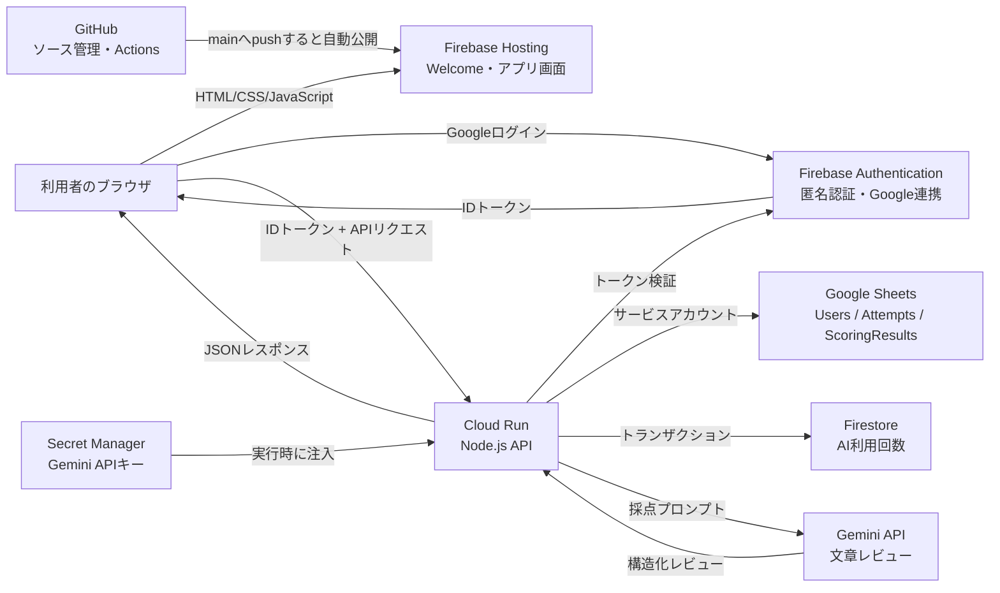
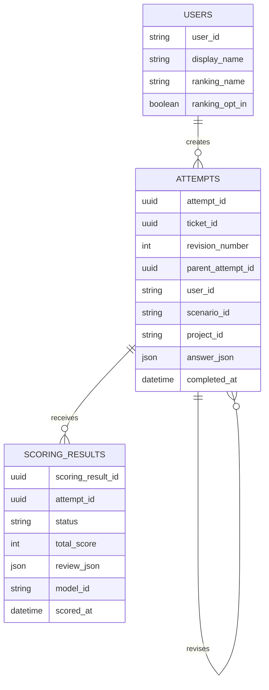
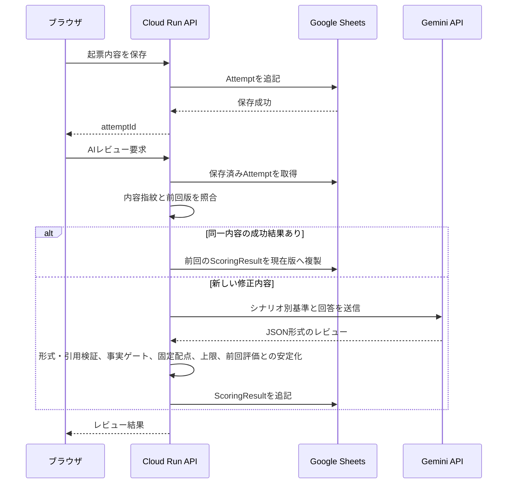
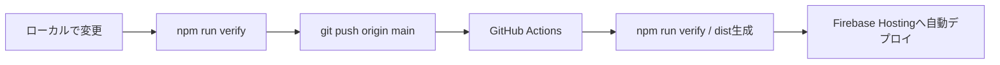

# あかマイン システム設計書（現行実装）

最終更新: 2026-09-14

対象: `akamain.com`で公開している現行システム
文書種別: As-Built（構想ではなく、現在動いている実装の説明）

## 1. システムの目的

あかマインは、未整理の不具合情報から、開発者が調査・判断できるバグチケットを作成する力を訓練するWebサービスである。

単なる文章入力ではなく、次の判断を含む練習を提供する。

- 現場メモから必要な事実を拾う
- 題名、再現手順、期待結果、実際の動作、備考を整理する
- 優先度、障害レベル、担当者、環境などのチケット項目を選ぶ
- ログ、画像、CSVなどの証跡を選ぶ
- AIレビューから、情報不足、曖昧さ、次の調査方法を学ぶ

## 2. 現行スコープ

### 2.1 実装済み

- Welcomeページ
- Firebase匿名認証と任意のGoogle連携
- ログイン不要の見本入力体験
- Redmine風のチケット作成画面
- 見本入力モード
- 実践起票モード
- 10プロジェクト、バグ起票60・QA起票60の合計120シナリオ
- 証跡選択
- Gemini APIによる6軸AIレビュー
- チケット一覧、詳細、修正版の版管理
- マイページの学習状況、履歴、ランキング
- Google Sheetsへの永続保存
- Firebase Hostingへのフロントエンド自動デプロイ
- Cloud Run上のNode.jsバックエンド

### 2.2 現時点で対象外または未完成

- メールアドレスとパスワードによる独自認証
- 本番のお問い合わせ送信バックエンド
- 決済・有料プラン
- 管理者画面
- Google Sheetsから本格データベースへの移行
- Cloud RunバックエンドのGitHub Actions自動デプロイ

## 3. 全体構成

## 4. コンポーネント

| コンポーネント | 採用技術 | 役割 |
| --- | --- | --- |
| フロントエンド | HTML / CSS / JavaScript | 画面表示、入力、状態管理、API呼び出し |
| 公開基盤 | Firebase Hosting | 静的ファイル配信、独自ドメイン、HTTPS |
| 認証 | Firebase Authentication / Google | 必要時の匿名認証、任意のGoogle連携 |
| API | Node.js / Cloud Run | 認証確認、保存、集計、Gemini連携 |
| コンテナ | Docker | Node.jsバックエンドと採点定義を実行可能な単位へ梱包 |
| 永続化 | Google Sheets API | ユーザー、挑戦、採点結果の保存 |
| AI | Gemini API | 起票文章の構造化レビュー |
| 利用制限 | Firestore | Gemini利用回数を利用者・IP・全体で共有管理 |
| 秘密情報 | Secret Manager | Gemini APIキーの保管とCloud Runへの受け渡し |
| ソース管理 | Git / GitHub | 履歴管理、レビュー、フロントエンド自動公開 |

## 5. フロントエンド設計

### 5.1 公開ページ

| 公開URL | ソース | 用途 |
| --- | --- | --- |
| `/` | `welcome.html` | サービス説明、Googleログイン、ゲスト体験 |
| `/app.html` | `index.html` | Redmine風トレーニング画面 |

`npm run build`で公開専用の`dist/`を生成する。`backend/`、`docs/`、`scoring/`、`.env`はFirebase Hostingへ含めない。

### 5.2 作成モード

| モード | ログイン | 内容 |
| --- | --- | --- |
| 見本入力 | 不要 | 完成例を見ながら入力し、チケット構成を覚える |
| 実践起票 | Googleログイン不要 | ローカルゲストとして開始し、保存・AIレビュー時に必要ならFirebase匿名アカウントを作成して起票を保存する |

ゲストでも実践起票、保存、AIレビュー、履歴、進捗およびランキングを利用できる。Google連携は任意であり、別端末からの利用、データ復旧および確認済みランキング表示に使用する。

### 5.3 主な画面状態

- 認証準備中、ゲスト、Google連携中、Google連携済み、エラー
- チケット一覧の待機、読み込み、成功、エラー
- 実践起票の入力中、保存中、AIレビュー中、成功、失敗
- マイページの読み込み、空データ、成功、エラー

非同期処理中は共通スピナーと`aria-busy`で待機状態を示す。

## 6. 認証・認可

### 6.1 ブラウザ側

1. 初回表示ではFirebaseアカウントを作らず、ローカルゲストとして開始する
2. 保存・AIレビューなどIDトークンが必要な操作でFirebase匿名アカウントを一度だけ発行する
3. Firebase SDKが認証状態をブラウザへ永続化する
4. API呼び出し時にFirebase IDトークンを`Authorization: Bearer <ID token>`として送る
5. 利用者がGoogle連携を選択した場合、Google Identity Servicesの認証情報を匿名アカウントへリンクする
6. すでに別のFirebaseアカウントへ連携済みの場合、ゲスト履歴を連携済みアカウントへ統合する

### 6.2 バックエンド側

1. Firebaseまたは移行期間中のGoogle IDトークンについて、署名、有効期限、発行元、対象プロジェクトまたはクライアントを検証する
2. Firebase UIDへ`firebase:`接頭辞を付けた値を内部ユーザーIDとして使用する
3. URLやリクエスト本文からユーザーIDを受け取らない
4. 本人のデータだけを検索・更新する

メールアドレスはユーザーIDに使用しない。既存のGoogle `sub`を主キーにした利用者は、初回Google連携時にFirebase UIDへ履歴を統合する。

## 7. API設計

すべての本人用`/api/*`は検証済みFirebase IDトークンを必要とする。Googleログイン操作は必須ではなく、匿名IDトークンも受け付ける。

| Method | Path | 役割 |
| --- | --- | --- |
| `POST` | `/api/identity/claim` | 別の匿名UIDで作成したゲスト履歴をGoogle連携済みUIDへ統合 |
| `GET` | `/api/me` | 本人プロフィール取得 |
| `PUT` | `/api/me/ranking-profile` | 公開名・ランキング参加設定 |
| `POST` | `/api/attempts` | 実践起票を保存 |
| `POST` | `/api/attempts/:attemptId/review` | 保存済み起票をAIレビュー |
| `GET` | `/api/tickets` | 本人のチケット一覧 |
| `GET` | `/api/tickets/:ticketId` | チケット最新版と全修正版 |
| `POST` | `/api/tickets/:ticketId/revisions` | 修正版を追記 |
| `GET` | `/api/history` | 本人の挑戦履歴 |
| `GET` | `/api/progress` | シナリオ別進捗 |
| `GET` | `/api/leaderboard` | オプトイン利用者のランキング |
| `POST` | `/api/scoring` | 保存と採点を一度に行う旧クライアント互換API |

保存とAIレビューを分離しているため、Geminiが失敗しても起票内容は失われない。

## 8. データ設計

現行の物理保存先はGoogle Sheetsで、次の3タブを使用する。

### 8.1 Users

Google認証で確認した利用者、表示名、ランキング公開設定を保存する。

### 8.2 Attempts

実践起票の回答、チケット項目、選択証跡、作成時刻を保存する。修正時は上書きせず、新しいAttemptを版として追加する。

### 8.3 ScoringResults

AIレビューの成功・失敗状態、総合点、6軸評価、改善提案、採点バージョンを保存する。API障害を0点として扱わない。

## 9. AIレビュー設計

### 9.1 評価軸

| 評価軸 | 重み | 見る内容 |
| --- | ---: | --- |
| 事実性 | 20 | 与えられた情報と矛盾せず、推測を断定していないか |
| 情報充足 | 20 | 調査に必要な事実が揃っているか |
| 再現性 | 20 | 開発者が現象を再現できるか |
| 期待・実績の分離 | 15 | 期待結果と実際の動作を区別できているか |
| 解釈の明瞭さ | 10 | 読み手によって意味が変わらないか |
| 切り分け支援 | 15 | 次の確認や調査につながるか |

### 9.2 採点処理

Geminiへ点数を任せない。Geminiは各評価、必須事実の状態、指摘を構造化JSONで返し、バックエンドが次を実施する。

- レスポンス形式の検証
- 必須事実の充足・欠落・矛盾から品質ゲートを決定
- 必須情報の欠落・矛盾確認
- チケット項目と期待値の照合
- 重大な不足がある場合の点数上限適用
- Geminiの感覚点ではなく品質ゲートと客観項目から表示点を計算
- 攻撃・採点操作をGemini実行前に40点上限・不合格とする
- 同一内容に対する成功済みレビューの再利用
- 修正版で明確な事実後退がない場合の、AI出力揺れによる減点抑止

### 9.3 Geminiへ送らない情報

- GoogleユーザーID
- メールアドレス
- Google表示名・プロフィール画像
- ランキング公開名
- 他利用者の回答や成績

## 10. セキュリティ設計

- Gemini APIキーはブラウザ、GitHub、HTMLへ置かない
- APIキーはSecret ManagerからCloud Runへ注入する
- SheetsはCloud Run専用サービスアカウントだけが編集する
- サービスアカウントJSON鍵を作成・保存しない
- APIごとにGoogle IDトークンを検証する
- CORSは許可した本番・開発オリジンだけに限定する
- AIレビューは1分・利用者日次・IP日次・全体日次で制限し、本番はFirestoreトランザクションでインスタンス間共有する
- APIレスポンスは`Cache-Control: no-store`とする
- 公開ビルドで`.env`、バックエンド、内部資料の混入を検査する

Cloud Runはネットワーク上到達可能だが、API利用はアプリケーション層のGoogle認証で保護する。

## 11. デプロイ設計

### 11.1 フロントエンド

GitHub ActionsはOIDC / Workload Identity Federationで短時間のGoogle認証情報を取得する。長期間有効なサービスアカウント鍵をGitHubへ保存しない。

### 11.2 バックエンド

バックエンドはDockerfileを使用し、Cloud Buildがコンテナイメージを作成してCloud Runへデプロイする。

現時点ではバックエンドの公開は手動の`gcloud run deploy`系コマンドで行う。フロントエンドの`git push`ではCloud Runは更新されない。

Cloud Runの運用設定は次を基本とする。

- リージョン: `asia-northeast1`
- コンテナ同時実行数: 10
- 最小インスタンス: 0
- 最大インスタンス: 2
- 実行ID: 保存専用サービスアカウント

## 12. テスト・品質保証

`npm run verify`で次をまとめて検証する。

1. JavaScript構文
2. シナリオと画面要素の整合性
3. 10プロジェクト・バグ60・QA60シナリオの定義
4. 公開用`dist/`の生成
5. 内部ファイル・秘密情報の混入防止
6. Welcomeとアプリのリンク

商品品質評価では代表15シナリオに良・中・悪・インジェクションの4回答、合計60件を用意している。`practice-review.v39`では各回答を3回、合計180回実APIで評価し、既知ケースの点数・判定完全一致を確認した。現行`v43`の全実API評価と未調整ホールドアウト評価は未完了であり、v39の数値を流用しない。

## 13. 現在の制約と移行方針

### 13.1 Google Sheetsの制約

Google Sheetsは試作・少人数運用には適するが、同時アクセス、検索性能、行数、誤操作耐性に限界がある。

利用増加時はFirestoreまたはPostgreSQLへ移行する。ブラウザは共通APIだけを呼び、Sheets固有処理をバックエンドのRepositoryへ隔離しているため、画面とAPI契約を大きく変えずに移行できる。

### 13.2 デプロイの制約

フロントエンドは自動、バックエンドは手動であり、両者のバージョン不一致が起こり得る。次段階では、バックエンド専用テストと承認ステップを含むGitHub Actionsを検討する。

### 13.3 AIの制約

生成AIの出力は完全には決定論的ではない。同一内容は保存済み結果を再利用し、修正版は前回評価を基準に比較する。構造化出力、固定seed、ルーブリック、サーバー側再計算、回帰検証で揺れを抑えているが、人間の最終判断を完全に代替するものではない。

本番設定ではFirestoreトランザクションを利用し、Cloud Runの複数インスタンス間で利用者、接続元IP、サービス全体の日次上限を共有する。レート制限ドキュメントは`expiresAt`を持ち、FirestoreのTTLポリシーにより期限後に自動削除する。ローカル開発の既定値はメモリ実装であり、プロセス再起動をまたがない。本番のFirestoreドライバーとTTL設定は2026-09-14に確認した。

## 14. 関連資料

- [プロダクト要件](../product/product-requirements.md)
- [AIレビュー・採点パイプライン](../architecture/ai-review-pipeline.md)
- [AIレビュー品質評価](../testing/ai-quality-evaluation.md)
- [脅威モデル](../security/threat-model.md)
- [設計判断記録](../decisions/README.md)
- [作成モード設計](./authoring-modes-spec.md)
- [永続化・API契約](./persistence-and-api-contract.md)
- [本番公開手順](../setup/production-release.md)
- [Cloud Runバックエンド](../setup/cloud-run-backend.md)
- [Google Sheets永続化](../setup/google-sheets-persistence.md)
- [AI採点自動検証](../setup/ai-scoring-fixture-validation.md)
